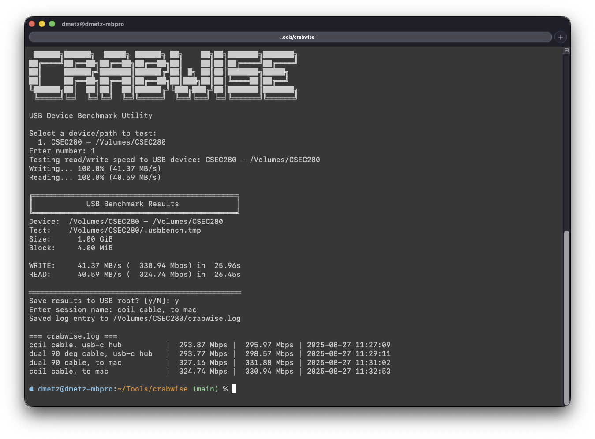

# Crabwise

**USB Device Benchmark Utility**

Crabwise is a lightweight Rust-based tool that benchmarks the true read/write speeds of USB devices. It’s designed with digital forensics and investigative workflows in mind, where reliable and fast devices are critical for evidence capture, tool processing, and virtual machine support.



---

## Why Crabwise?

In practice, a number of variables can affect USB performance:

- **Device capability**: Reported specs from manufacturers may not reflect actual throughput.  
- **Cables**: The quality, length, and type of USB cable used can impact speed significantly.  
- **Connection path**: Direct-to-system connections typically outperform multi-hop hub setups.  

Crabwise provides a way to measure and document these differences so you can make informed decisions about your setup.

---

## How It Works

- **Write Test**: Creates a temporary file of configurable size (default 1 GiB) with pseudo-random data and measures sustained write throughput.  
- **Read Test**: Reads the file back under uncached/direct I/O conditions to ensure reported numbers reflect device performance rather than RAM cache.  
- **Progress Display**: Shows percentage complete and current MB/s throughput during both write and read phases.  
- **Results Box**: Summarizes results in MB/s and Mbps with timing details.

---

## Logging Feature

After each run, Crabwise will prompt you to save the results to the root of the tested USB device.

- If you choose **yes**, results are appended to a `crabwise.log` file.  
- Each entry includes:
  - **Session name** (user-provided, e.g., *“coil cable via hub”*)  
  - **Read speed**  
  - **Write speed**  
  - **Timestamp**

This creates a simple reference table for comparing different setups:

```
=== crabwise.log ===
coil cable, usb-c hub          |  293.87 Mbps |  295.97 Mbps | 2025-08-27 11:27:09
dual 90 deg cable, usb-c hub   |  293.77 Mbps |  298.57 Mbps | 2025-08-27 11:29:11
dual 90 cable, to mac          |  327.16 Mbps |  331.88 Mbps | 2025-08-27 11:31:02
coil cable, to mac             |  324.74 Mbps |  330.94 Mbps | 2025-08-27 11:32:53
```
---

## Installation

Clone the repository and build with Cargo:

```bash
git clone https://github.com/dwmetz/crabwise.git
cd crabwise
cargo build --release
```
---

## Usage


```bash
# Run Crabwise
cargo run --release
